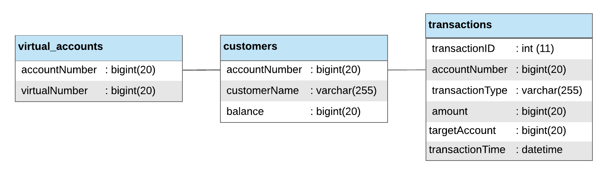

<h1 align="center">
    <b>
        <br>
        # Tugas Besar 2 IF3110 Pengembangan Aplikasi Berbasis Web
        <br>
    </b>
</h1>

<h2 align="center">
    <b>
        <br>
        Web Service Bank Pro
        <br>
        <br>
    </b>
</h2>

## Deskripsi Singkat
Web service Bank diimplementasikan di atas ​java servlet menggunakan JAX-WS dengan ​protokol SOAP​. ​Web service ini digunakan oleh Aplikasi Bank Pro dan Aplikasi Engima.

Layanan yang disediakan oleh ​web service ​ini adalah:
1. Validasi nomor rekening. Jika nomor rekening terdaftar di basis data, maka nomor tersebut valid.

2. Memberikan data rekening seorang nasabah. Data pengguna meliputi nama pengguna, nomor kartu, saldo terakhir, dan riwayat transaksi (debit dan kredit).

3. Melakukan transaksi transfer dengan input nomor rekening pengirim, nomor rekening/akun virtual penerima, dan jumlah uang yang ditransfer. Layanan mengembalikan status transfer (berhasil/gagal).<br>Transfer dikatakan berhasil jika:<br>• Nomor rekening atau akun virtual tujuan valid<br>• Saldo rekening mencukupi untuk transaksi Jika transfer berhasil, akan dicatat transaksi debit pada rekening pengirim dan transaksi kredit pada rekening penerima.

4. Melakukan penambahan saldo rekening dengan input jumlah uang yang ingin dimasukan ke rekening.

5. Membuat akun virtual untuk suatu nomor rekening. Layanan mengembalikan nomor unik akun virtual tersebut.

6. Mengecek ada atau tidak sebuah transaksi kredit dalam suatu rentang waktu. Input yang diterima adalah nomor rekening atau akun virtual tujuan, jumlah nominal yang diharapkan, dan ​jangka waktu (dalam menit) rentang waktu (start datetime, end datetime)​.

<br>

Cara menjalankan:

| local                                                                                               |
|:----------------------------------------------------------------------------------------------------|
| ketikan ```mvn package``` pada direktori root web bank pro                                          |
| copy file web_service_bank_pro yang ada di dalam folder target ke folder webapps pada folder tomcat |
| jalankan server tomcat                                                                              |

| AWS EC2                                                                                             |
|:----------------------------------------------------------------------------------------------------|
| ketikan ```http://18.207.202.246:8080/web_service_bank_pro/services/Login``` pada web browser       |

## Basis Data Web Service


| Nomor | Relasi           | Penjelasan                                                                       |
|:-----:|:-----------------|:---------------------------------------------------------------------------------|
| 1     | customers        | Relasi yang berisi data nasabah (terdiri dari nomor akun nasabah, nama nasabah dan jumlah saldo nasabah) |
| 2     | transactions     | Relasi yang berisi data transaksi nasabah (terdiri dari id transaksi, nomor akun nasabah, tipe transaksi, besar transaksi, nomor akun tujuan transaksi (dapat berupa nomor akun atau nomor akun virtual) dan waktu transaksi dilakukan) |
| 3     | virtual_accounts | Relasi yang berisi data akun virtual nasabah (terdiri dari nomor akun nasabah dan nomor akun virtual nasabah) |

<br>

## Pembagian Tugas

### CI/CD
| Number | Feature                | Assignment |
|:------:|:-----------------------|:-----------|
| 1.     | Linting                | 13517137   |
| 2.     | Deployment to AWS EC2  | 13517137   |

<p align="center">
    <b>
        <br>
        <font size="6">
            About
        </font>
    </b>
</p>

<p align="center">
    <b>
        IF3110-Pengembangan Aplikasi Berbasis Web - 2019
        <br>
        Teknik Informatika 2017
        <br>
        <br>
        13517137 - Vincent Budianto
    </b>
</p>